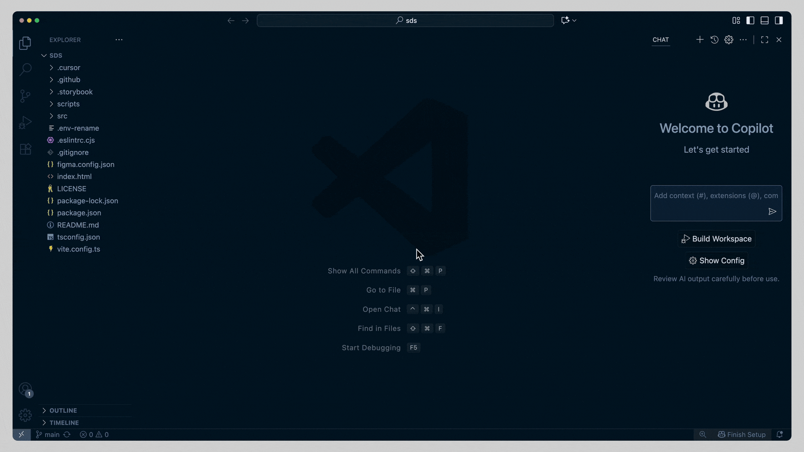
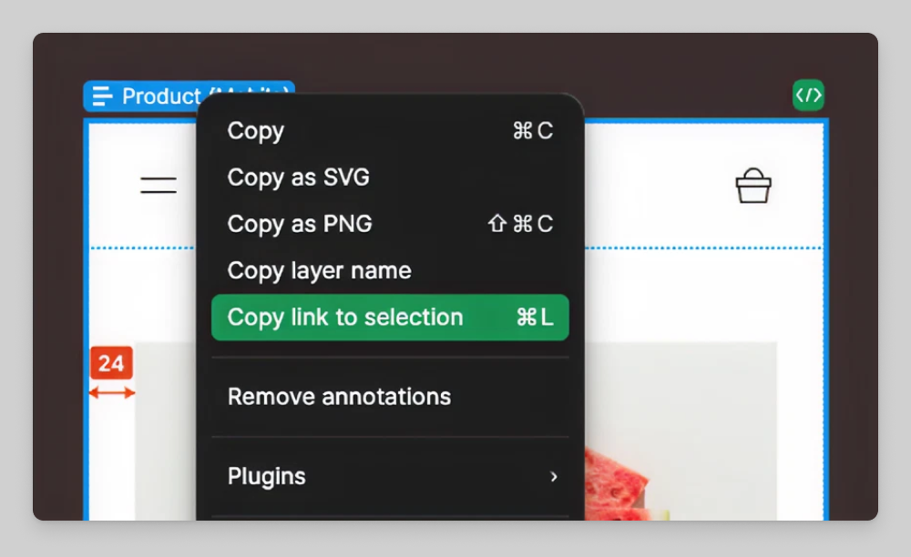

# Figma MCP Starter Guide

**Rasmus Cederdorff (RACE)**  
Senior Lecturer & Web App Developer  
race@eaaa.dk

---

## Purpose

This guide helps you get started with Figma MCP in VS Code and use it in a small React project.

The goal is not to generate a perfect app in one prompt.

The goal is to:

1. set up Figma MCP correctly
2. create a small React project
3. use a Figma design as context
4. inspect the generated code
5. improve the result with your own React knowledge

---

## Quick Version

If you want the short version, do this:

1. Set up the **remote** Figma MCP server in VS Code.
2. Create a blank React project with Vite.
3. Make or choose **one** clean Figma frame.
4. Paste a link to that frame into Copilot, Codex, or Claude Code in VS Code.
5. Ask it to implement the design in your React project.
6. Run the app, inspect the code, and improve the result.

If that works, then move on to more screens, more views, and more advanced tasks.

---

## Before You Start

Make sure you have:

- VS Code installed
- GitHub Copilot enabled in VS Code
- Node.js and npm installed
- Figma installed

You can also use Codex or Claude Code in VS Code.

Note:

- GitHub Copilot is required for the official Figma MCP setup flow in VS Code.
- Claude Code requires a paid Claude plan.
- For this course, use the **remote Figma MCP server**, not the desktop server.

Official setup article:

- [VS Code and Figma: Set up the MCP server](https://help.figma.com/hc/en-us/articles/39890361040535-VS-Code-and-Figma-Set-up-the-MCP-server)

---

## Exercise

### 1. Set up the remote Figma MCP server in VS Code



The GIF above shows the last part of the setup flow in VS Code.

Do these steps directly in VS Code:

1. Open the **Command Palette**:
   - macOS: `Cmd + Shift + P`
   - Windows: `Ctrl + Shift + P`
2. Search for `MCP: Open User Configuration`.
3. Open the `mcp.json` file that VS Code shows you.
4. Paste this configuration into the file:

```json
{
  "inputs": [],
  "servers": {
    "figma": {
      "url": "https://mcp.figma.com/mcp",
      "type": "http"
    }
  }
}
```

5. Save the file:
   - macOS: `Cmd + S`
   - Windows: `Ctrl + S`
6. After saving, stay in VS Code and look for the Figma MCP server entry. See the GIF above.
7. When you see a **Start** button above the Figma server entry, click it to begin authentication.
8. Complete the authentication flow in the external browser window using your Figma account.
9. Return to VS Code and confirm that the Figma MCP server is now running. See the GIF above if you are unsure what this should look like.

Expected result:

- The Figma MCP server appears as **running** in VS Code.

Important:

- This guide only covers the **remote** Figma MCP server.
- Do **not** continue to the **desktop Figma MCP server** section in the official guide.

If the Figma guide changes in the future, use the official article here:

- [VS Code and Figma: Set up the MCP server](https://help.figma.com/hc/en-us/articles/39890361040535-VS-Code-and-Figma-Set-up-the-MCP-server#h_01KPPGM2WBVB21ZYNEXJYDH16P)

---

### 2. Create a new React project

1. Create a new project folder on your machine.
2. Open that folder in VS Code, and only that folder.
3. Open the terminal in VS Code.
4. Run:

```bash
npm create vite@latest . -- --template react
```

5. Then run:

```bash
npm install
```

6. Start the project:

```bash
npm run dev
```

7. Open the local URL in the browser and make sure the blank React app works before you continue.

---

### 3. Choose a Figma design

Start simple.

For your first try, use:

- one main screen, or
- one small flow with two screens

Recommended:

- Recreate the **Codeagram** feed in Figma, or
- use Figma Make to help you create a first draft, then copy the result into a normal **Figma Design** file

Make sure your design is as structured as possible:

- use Auto Layout where it makes sense
- use components for repeated UI
- name layers clearly
- keep spacing and hierarchy clean
- avoid messy or half-finished frames

Important:

- Figma MCP works better when the design is structured well.
- Do not start with a huge multi-page app.
- Start with one good frame.

---

### 4. Get the Figma link for design context

This step is based on the official Figma guide:

- [Guide to the Figma MCP server](https://help.figma.com/hc/en-us/articles/32132100833559-Guide-to-the-Figma-MCP-server#example-get-design-context)

The remote Figma MCP workflow is **link-based**.

Your goal in this step is only to get the correct link to the frame or layer you want to use as context.

Do this:

1. In Figma Design, select the frame or layer you want to work from.
2. Copy the link to that frame or layer.

How to copy the link:

- **If you are using Figma in the browser:**
  - select the frame or layer
  - copy the link from the browser address bar, or
  - use **Copy link to selection**
- **If you are using the Figma desktop app:**
  - select the frame or layer
  - right-click the frame on the canvas or in the Layers panel
  - go to **Copy/Paste as > Copy link**

Tip:

- For the remote MCP server, the important thing is that you get a URL pointing to the frame or layer you want to use as context.



Important:

- Start with one frame or one important part of the design.
- Do not begin with a huge multi-screen app unless your design is very small.
- Your MCP client will not open the Figma link like a browser tab. Instead, it extracts the node ID from the URL and uses that to get design context from Figma.

---

### 5. Prompt your MCP client

Now use the link from step 4 in your MCP-enabled chat in VS Code.

In VS Code:

1. Open GitHub Copilot Chat, Codex, or Claude Code.
2. Paste the Figma link into the chat.
3. Ask the AI to implement the design in your blank React project.

Start simple.

For the first prompt, ask for:

- one screen
- a simple component structure
- a working first version
- an explanation of what files it changes

Suggested first prompt:

```text
Use this Figma link as design context:
[PASTE FIGMA LINK HERE]

Implement the screen in this React project.
Keep the code simple.
Split the UI into meaningful components.
Use props where values repeat.
Tell me what files you create or change.
Explain the component structure briefly before or after you make the changes.
```

If you want a slightly more technical version, try this:

```text
Use this Figma link as design context:
[PASTE FIGMA LINK HERE]

Implement this screen in my blank React project.
Use a clean component structure.
Keep the styling simple.
Do not over-engineer the solution.
Tell me what files you create or change, and explain the components you add.
```

Important:

- Start with one frame, not a whole app.
- Do not ask for too many features in the first prompt.
- First get a working version. Then improve it in later prompts.
- If the result is messy, ask for refactoring in the next prompt instead of trying to fix everything at once.

More official prompt examples:

- [Tools and prompts](https://developers.figma.com/docs/figma-mcp-server/tools-and-prompts/)

After the AI has made changes:

1. let it do the work
2. run the app
3. check whether it actually works
4. restart the dev server if needed
5. if something breaks, read the error before prompting again

Do not continue until you have a real first result running in the browser.

---

### 6. Investigate the code

Do not stop at “it works”.

Look at the code and ask:

1. How is the project structured?
2. What components do you see?
3. Where are props used?
4. Is any state used?
5. Does the component structure make sense?
6. How is it different from your own Codeagram implementation?
7. What looks good?
8. What looks messy, over-generated, or too literal?

This step is important.

MCP and AI can help you move faster, but you still need React knowledge to evaluate the result.

---

## Prompting Tips and Best Practices

When you prompt your MCP client, these habits usually lead to better results:

### Start small

- Start with one frame, not a whole app.
- Ask for one working screen before asking for multiple pages.
- Get a simple result first, then improve it.

### Be specific

- Say exactly what you want the AI to do.
- If you want structure help, ask for structure help.
- If you want styling help, ask for styling help.
- If you want refactoring, say that directly.

### Improve one thing at a time

- Do not ask for layout fixes, new features, routing, animations, and refactoring in the same prompt.
- Change one thing, test it, then continue.

### Use better links

- Link to the whole frame when you want a first implementation.
- Link to a specific component, layer, icon, or section when you want a more targeted change.
- Smaller context often gives cleaner results.

### Ask for explanation

- Ask the AI to explain the files it changed.
- Ask it to explain the component structure.
- Ask it where props and state are used.

### Ask for React quality, not only visual similarity

- A result can look correct and still be poorly structured.
- Ask whether the component structure can be improved.
- Ask whether repeated values should become props.
- Ask whether the code is too duplicated or too literal.

### Compare against your own knowledge

- Do not assume the generated code is “correct” just because it runs.
- Compare it to your own Codeagram implementation.
- Use your own React understanding to judge the result.

### Example follow-up prompts

```text
Refactor this implementation into clearer reusable React components.
Explain what you change and why.
```

```text
Use this Figma link for the navigation only.
Update my existing React code so the navigation matches the design more closely.
Keep the current functionality working.
```

```text
The UI works, but the component structure feels messy.
Please clean up the structure without changing the visual result.
```

---

### 7. Improve the result

Now iterate.

Ask yourself:

1. Did it implement the design closely enough?
2. Is the code structure too flat or too messy?
3. Should you improve something yourself?
4. Should you ask AI to improve something specific?

Important:

- It is often better to link to a specific frame, component, layer, or icon than to the whole design.
- Smaller and more focused prompts usually work better.

Example prompt:

```text
Use this Figma link for the PostCard only.
Refactor my current implementation so PostCard becomes its own reusable component.
Keep the existing behavior working.
```

Repeat this process until the result becomes better.

Important:

- Do not only ask for visual fixes.
- Also ask for structural improvements when needed.
- A nicer-looking result is not always a better React implementation.

---

### 8. Add more screens or views

If your first screen works, continue.

For example in Codeagram:

1. Add a **Profile** page in Figma.
2. Add a **Notifications** page in Figma.
3. Improve the design structure if needed.
4. Ask the AI to implement the new pages.
5. Connect the pages in React.

Helpful technical direction:

- Ask for **React Router** if you want multiple pages or views.

Example prompt:

```text
Use React Router to add a profile page and a notifications page based on these Figma links.
Keep the existing feed page working.
Update the navigation so the pages can be opened.
```

Then test whether navigation actually works.

---

### 9. Use the advanced Codeagram tasks

Now combine:

- Figma design work
- MCP context
- AI prompting
- your own React knowledge

Use the advanced tasks from:

- [Codeagram Feed with React Components](https://github.com/cederdorff/codeagram/blob/main/docs/EXERCISE_GUIDE.md)

Suggested tasks:

1. Add tags to the post data
2. Add comments to the post data
3. Implement search
4. Show bookmarked posts in their own view
5. Make it possible to create new posts
6. Add one more action button

Try different strategies:

- start in Figma, then go to code
- start in code, then ask AI to update the design
- link to the whole screen
- link to one specific component

Compare the results.

---

### 10. Try a new design-to-code experiment

When Codeagram feels more stable, try a new small app:

1. use an existing Figma design, or create one
2. create a new React project
3. set up the workflow again
4. prompt, inspect, improve, repeat

Start simple.

Do not try to build a huge app on your first attempt.

---

## Minimum Success Criteria

You are on the right track if you can say yes to most of these:

1. Is the remote Figma MCP server running in VS Code?
2. Does your blank React project run locally?
3. Have you used one Figma link as design context successfully?
4. Did the AI create a working first version in React?
5. Can you explain at least some of the generated component structure?
6. Have you improved at least one part of the generated code or design?
7. Does the result feel closer to a small prototype than just a static screen?

---

## Tips for Better Results

- Start with one clean frame, not a whole product.
- Structure your Figma design before prompting.
- Ask for a simple implementation first.
- Inspect the generated code before continuing.
- Be specific when asking for improvements.
- Use your own React knowledge to clean up the result.
- Treat MCP and AI as support, not as a replacement for understanding.

---

## If You Get Stuck

1. Check whether the problem is:
   - MCP setup
   - Figma structure
   - prompting
   - React code
2. Restart VS Code and the dev server if something seems stuck.
3. Try a smaller prompt with a smaller part of the design.
4. Ask the AI to explain the code it created.
5. Ask for help if you are blocked too long.

### Common Problems

#### The MCP server does not seem to work

- Check that you set up the **remote** server, not the desktop one.
- Check that GitHub Copilot is enabled in VS Code.
- Restart VS Code and try again.
- Open the MCP configuration again and verify that the Figma server is still listed.

#### The AI does not understand the design

- Use a smaller and cleaner Figma frame.
- Link to one part of the design instead of the whole app.
- Improve the Figma structure first.

#### The React project does not run

- Make sure you ran `npm install`.
- Restart the dev server with `npm run dev`.
- Read the terminal error carefully before prompting again.

#### The generated code works but looks messy

- Ask the AI to refactor the component structure.
- Ask it to explain what it created.
- Compare it to your own Codeagram implementation.

---

## Recommended Official Resources

Start with these:

1. [VS Code and Figma: Set up the MCP server](https://help.figma.com/hc/en-us/articles/39890361040535-VS-Code-and-Figma-Set-up-the-MCP-server)
2. [Guide to the Figma MCP server](https://help.figma.com/hc/en-us/articles/32132100833559-Guide-to-the-Figma-MCP-server)
3. [Tools and prompts](https://developers.figma.com/docs/figma-mcp-server/tools-and-prompts/)
4. [Figma MCP collection](https://help.figma.com/hc/en-us/sections/35280374295831-Figma-MCP-collection)

The Figma MCP collection is a good extra resource, but I would use it as **optional support**, not as the main exercise text.

---

## Why We Are Doing This

The point of this exercise is not only to see whether AI can generate code from a design.

The real point is to understand:

- how design becomes components
- how components become React code
- where AI is helpful
- where you still need technical judgement
- how to improve generated output instead of accepting it blindly

---
